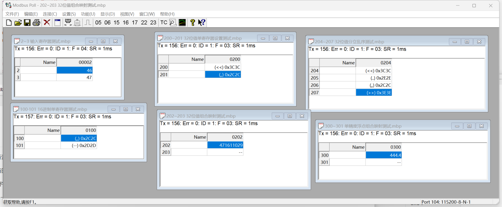
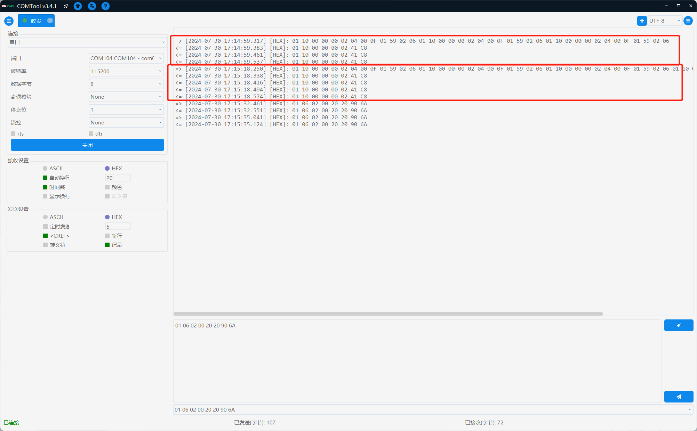
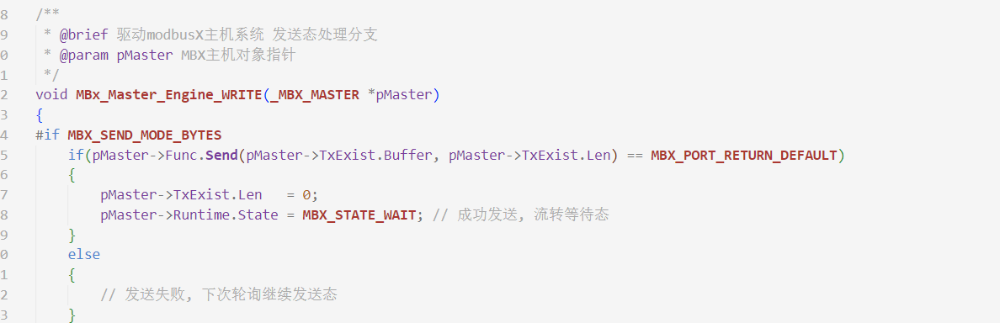
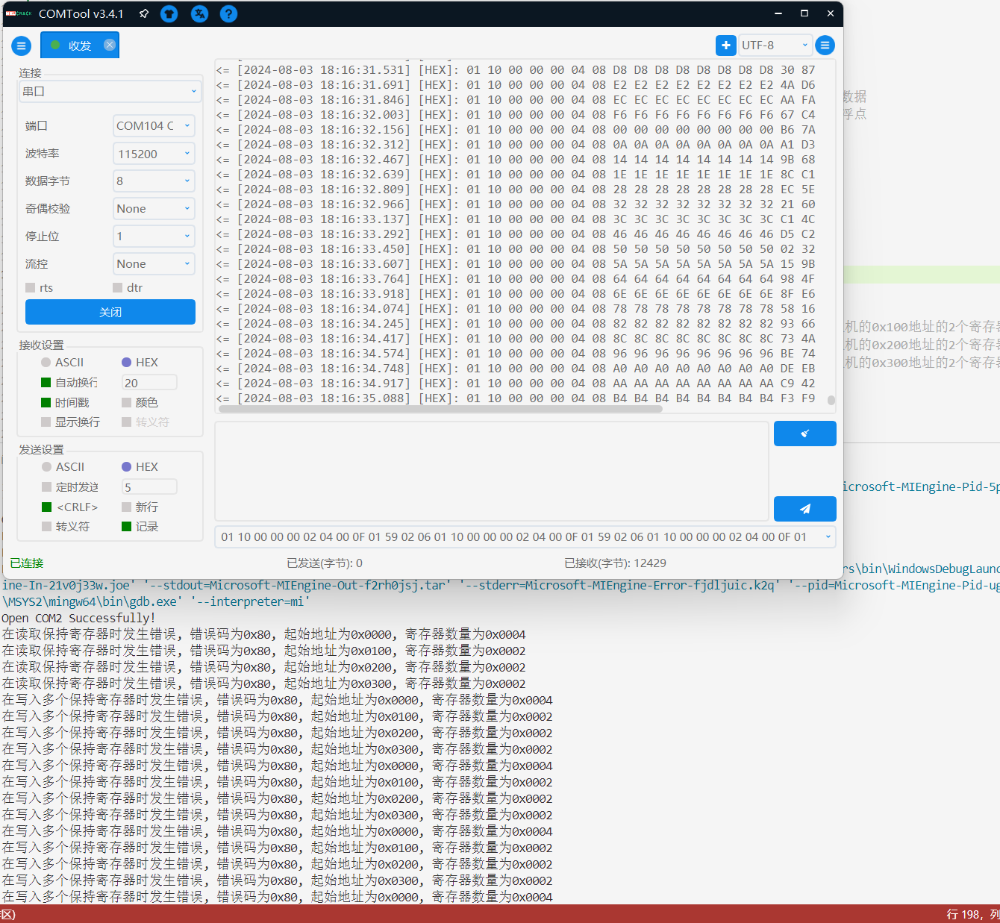

# 测试介绍

使用winows系统的API，调用系统串口进行测试。

借助虚拟串口软件可以很方便地桥接到已有的modbus调试软件上，对库进行测试。

使用**`COM_PORT_NAME`**宏定义了期望测试软件使用的串口号。

modbus调试软件则需要使用虚拟串口的另一端。

# 测试流

使用了vscode的c/c++插件。

和gcc编译链，以及gdb调试，这些自行在电脑上安装。

tasks.json中"gcc build_test"任务的gcc路径应该改为自己的。

launch.json中"C/C++: gcc.exe 生成和调试活动文件"的gdb路径应该改为自己的。

打开期望编译的入口c文件，比如RTU_Smain.c。使用ctrl+shift+P，run build task，运行名为"gcc build_test"的编译任务。

打开期望调试的入口c文件，比如RTU_Smain.c。在调试透视窗，在下拉框选择"gcc build_test"的调试任务，启用调试。

# 从机测试

轮询时间均为1ms。

而且支持自动分帧哪怕RTU(虽然是不符合modbus标准的，纯私货)。依照标准如果不符合一发一回出现连帧，那么啥也不干。

# 主机测试

由于主机并非被动运行，需要主动动作，环境情景较多，不放出功能测试截图了，仅说明可能的异常下会发生什么。

## 没有实际通信连接，发送及接收port始终返回错误

由于存在请求未发出，该对象驱动状态机静止在发送态

## 有实际通信，但并不是合适的modbus从机

在错误栈中可提取错误信息，并由用户程序进行自由处理。但由于请求栈大小的问题，未如期处理导致部分程序中的请求丢失。(当然也可以检查发起请求的API的返回值)

