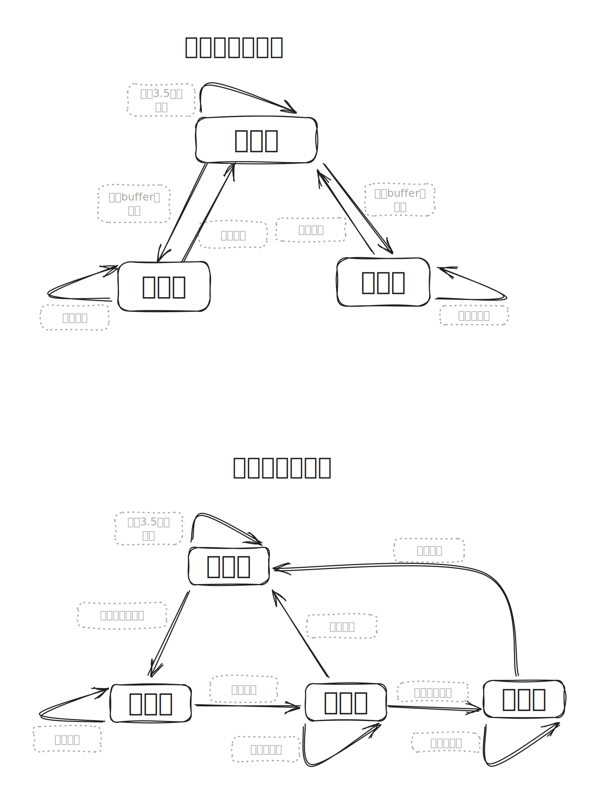
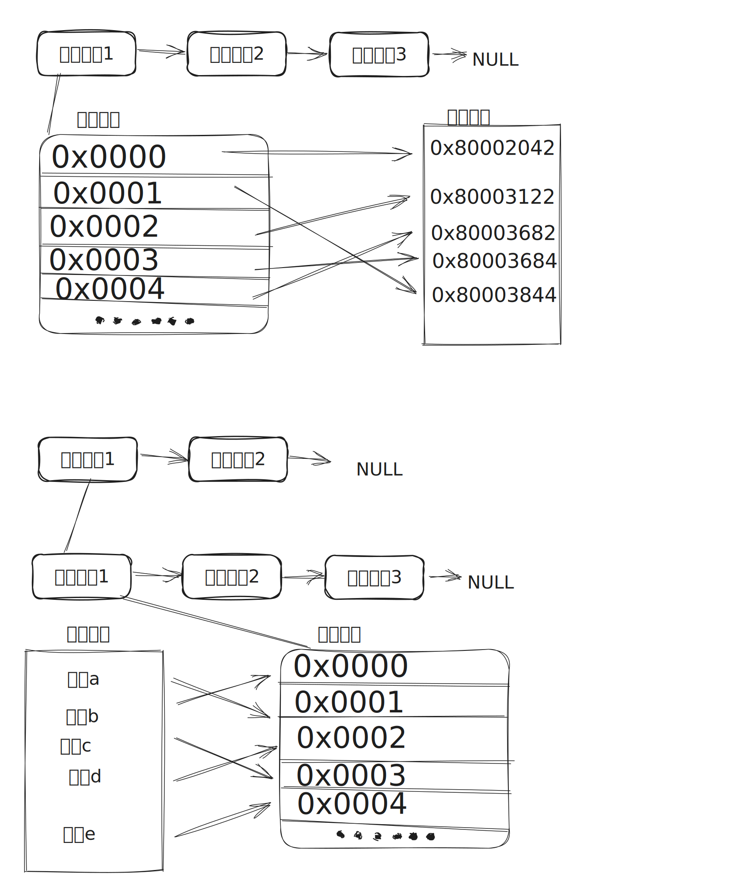

<p align="center">
 <h1 align="center">modbusX</h1>
 <p align="center">一个物理驱动层解耦的 modbus 协议解析栈</p>
</p>

<p align="center">
    <a href="https://github.com/anuraghazra/github-readme-stats/graphs/contributors"></a>
    <a href="https://mit-license.org"></a>
    <a href="https://github.com/stbanana/modbusX/actions/workflows/c-cpp.yml"></a>
</p>

<p align="center">
    <a href="https://wiki.yono233.cn/modbusX/zh_hans/">文档</a>
</p>

<p align="center">
    <a href="/README.md">简体中文</a>
    ·
    <a href="/Example/README.DATA/README_EN.md">English</a>
</p>

## ✨特性

我对协议库的理解是：只需要另外实现数据的流入和流出 port，并最多另外定时调用一个时基函数，就可以驱动起整个库(轮询)。

另外想了解 modbus 协议有 [modbus协议介绍](https://www.yono233.cn/posts/shoot/24_7_26_modbus协议介绍(未完成))

另外有本库的轻量化报告 [资源占用测试报告](https://wiki.yono233.cn/modbusX/zh_hans/apidoc/tools/资源占用测试报告.html)

另外有帮助建立 DMA 以及半双工驱动的简单实例 [Dataflow-驱动中间件](https://github.com/stbanana/Dataflow)

我希望有这样的 modbus 实现，是硬性需求，同时也是这个库最终的特性。

> 1. ⚡**不阻塞**：使用库 tick，禁止阻塞
> 2. 🪶**不占线程**：单 tick 驱动整个主从链，以任何方式周期运行 tick
> 3. 🌠**不占中断**：自由的 port 绑定，以任意方式管理数据流
> 4. 💪**多主多从**：任何主机或从机都是独立对象，可在程序中开启任意多个主从机
> 5. 🗽**寄存器地址表与内存地址任意映射**：本库的重要特性，解决 modbus 虚拟地址与实际变量之间的映射关系，使得开发更为简单且自由，整个库的使用完全围绕这个映射表展开，未来的维护同样只需维护映射表。
> 6. ⚖️**不同的地址映射查找时间，相差应当不超过 500 个时钟周期**：很难说是实现了，由于 modbus 最多也就 0xFFFF 个虚拟地址，所以采用了二分法查找，但这样还是不够自由便利，未来会找到更好的表查找结构(或许)。这是库升级的难点，有方案的请与我联系，非常感谢😘！
> 7. 🏃‍♀️**克制的事件回调**：少量的回调机制。尽可能使用栈轮询，尽可能少地影响系统时序。

# 📚功能计划(按优先级排序)

- [x] RTU 主从机的输入和保持寄存器读写
- [x] 主机写入成功的同步机制
- [x] 主机写入失败的回调处理机制
- [x] TCP 主从机的输入和保持寄存器读写
- [ ] RTU 主从机的线圈和离散输入读写
- [ ] TCP 主从机的线圈和离散输入读写
- [ ] 动态地址映射表的支持


# 🤔如何使用

> [!NOTE]
>
> 需要注意的是，由于部分工具函数采用了`__weak`定义，所以需要使用 c11 及以上标准。
> 如果现有工程是 C99 ，需要修改库以进行兼容，搜索所有`__weak`函数并删除这个关键词即可，其他代码符合 C99 。

## RTU 从机

首先实现通信端口的 port 函数类似如下

```C
/**
 * @brief 将 MBX_SEND_MODE_BYTES 宏置1后, 可用多字节发送port
 * @param Data 发送buffer指针
 * @param Len 期望发送的长度
 * @return port标准返回
 */
uint32_t SerialSendPort(const void *Data, size_t Len)
{
    WINBOOL b     = FALSE; // 发送操作标识
    DWORD   wWLen = 0;     // 实际发送数据长度
    /* 尝试发送 */
    b = WriteFile(comHandle, Data, Len, &wWLen, NULL);
    if(b && wWLen == Len)
        return MBX_PORT_RETURN_DEFAULT;
    else
        return MBX_PORT_RETURNT_ERR_INDEFINITE;
}

/**
 * @brief 数据接收port, 实现功能为取单字节, 返回值表示是否取接收成功
 * @param Data 字节指针, 取到的字节
 * @return port标准返回
 */
uint32_t SerialGetcPort(uint8_t *Data)
{
    WINBOOL b     = FALSE; // 接收操作标识
    DWORD   wRLen = 0;     // 实际接收数据长度
    /* 尝试接收 */
    b = ReadFile(comHandle, Data, 1, &wRLen, NULL);
    if(b == TRUE && wRLen == 1)
    {
        return MBX_PORT_RETURN_DEFAULT;
    }
    else
    {
        return MBX_PORT_RETURNT_ERR_INDEFINITE;
    }
}
```


然后制作一张类似如下的地址映射表，注意以下两点，

> 1. 数据模型的**寄存器地址必须递增**，库内使用二分法查找以提高查找效率
> 2. **如果映射到的内部内存变量相同，那么回调处理也应该相同**，因为库会最终将整个变量期望修改的值以 void* 形式传入写时回调，写时回调应当再翻译为对应的数据，详见例程 [在 windows 平台的 RTU 从机例子](Example/win_test/RTU_Smain.c)

```c
/* 假设供映射的内存区域，也可以是任意变量或任意地址 */
uint8_t  u8MapMem[64];
uint16_t u16MapMem[64];
uint32_t u36MapMem[64];
uint64_t u64MapMem[64];
float    fMapMem[64]; // 32位数据模型
double   dMapMem[64]; // 64位数据模型

/* 为了实现更快速的查找，库内采用二分法查询地址表
    地址表必须手动以升序排列，由于C11标准不支持动态宏，暂时无法在编译阶段自动检查 */
static const _MBX_MAP_LIST_ENTRY MapList[] = {
    /*  寄存器地址        映射到的内部内存              内部内存数据属性         写时回调(NULL为只读寄存器)  */
    {.Addr = 0x0000, .Memory = &u8MapMem[0],  .Type = MBX_REG_TYPE_U8,    .Handle = u8WriteTest1 },
    {.Addr = 0x0001, .Memory = &u8MapMem[1],  .Type = MBX_REG_TYPE_U8,    .Handle = u8WriteTest2 },
    {.Addr = 0x0002, .Memory = &u8MapMem[2],  .Type = MBX_REG_TYPE_U8,    .Handle = NULL         },
    {.Addr = 0x0003, .Memory = &u8MapMem[3],  .Type = MBX_REG_TYPE_U8,    .Handle = NULL         },
    
    {.Addr = 0x0100, .Memory = &u16MapMem[0], .Type = MBX_REG_TYPE_U16,   .Handle = u16WriteTest1},
    {.Addr = 0x0101, .Memory = &u16MapMem[1], .Type = MBX_REG_TYPE_U16,   .Handle = u16WriteTest2},
    
    {.Addr = 0x0200, .Memory = &u36MapMem[0], .Type = MBX_REG_TYPE_U32_H, .Handle = u32WriteTest1},
    {.Addr = 0x0201, .Memory = &u36MapMem[0], .Type = MBX_REG_TYPE_U32_L, .Handle = u32WriteTest1},
    
    {.Addr = 0x0300, .Memory = &u64MapMem[0], .Type = MBX_REG_TYPE_U64_3, .Handle = u64WriteTest1},
    {.Addr = 0x0301, .Memory = &u64MapMem[0], .Type = MBX_REG_TYPE_U64_2, .Handle = u64WriteTest1},
    {.Addr = 0x0302, .Memory = &u64MapMem[0], .Type = MBX_REG_TYPE_U64_1, .Handle = u64WriteTest1},
    {.Addr = 0x0303, .Memory = &u64MapMem[0], .Type = MBX_REG_TYPE_U64_0, .Handle = u64WriteTest1},
    
    {.Addr = 0x0400, .Memory = &fMapMem[0],   .Type = MBX_REG_TYPE_U32_H, .Handle = fWriteTest1  }, 
    {.Addr = 0x0401, .Memory = &fMapMem[0],   .Type = MBX_REG_TYPE_U32_L, .Handle = fWriteTest1  },
    
    {.Addr = 0x0500, .Memory = &fMapMem[0],   .Type = MBX_REG_TYPE_U64_3, .Handle = dWriteTest1  }, 
    {.Addr = 0x0501, .Memory = &fMapMem[0],   .Type = MBX_REG_TYPE_U64_2, .Handle = dWriteTest1  },
    {.Addr = 0x0502, .Memory = &fMapMem[0],   .Type = MBX_REG_TYPE_U64_1, .Handle = dWriteTest1  }, 
    {.Addr = 0x0503, .Memory = &fMapMem[0],   .Type = MBX_REG_TYPE_U64_0, .Handle = dWriteTest1  },

    MBX_MAP_LIST_END
};
```


在主程序中进行初始化

```c
/* 申请从机对象发送及接收buffer */
uint8_t *SRxBuffer = (uint8_t *)malloc(84 * sizeof(uint8_t));
uint8_t *STxBuffer = (uint8_t *)malloc(84 * sizeof(uint8_t));

/* 初始化RTU从机1 */
MBx_Slave_RTU_Init(&MBxSlave,      // 从机对象
                   1,              // 从机ID
                   MapList,        // 地址映射表
                   SerialSendPort, // 发送函数
                   SerialGetcPort, // 接收函数
                   9600,           // 波特率
                   SRxBuffer,      // 库内接收buffer分配
                   84,             // 接收buffer最大长度
                   STxBuffer,      // 库内发送buffer分配
                   84);            // 发送buffer最大长度

/* 假装初始化从机2(如果真的有，把传参填写正常) */
MBx_Slave_RTU_Init(&MBxSlave2,     // 从机对象
                    2,              // 从机ID
                    MapList,        // 地址映射表
                    MBX_PARA_NULL,  // 发送函数
                    MBX_PARA_NULL,  // 接收函数
                    MBX_PARA_NULL,  // 波特率
                    MBX_PARA_NULL,  // 库内接收buffer分配
                    MBX_PARA_NULL,  // 接收buffer最大长度
                    MBX_PARA_NULL,  // 库内发送buffer分配
                    MBX_PARA_NULL); // 发送buffer最大长度
```


周期调用驱动函数即可

```c
    while(1)
    {
        MBx_Ticks(1000);  // 换算为微秒传入MBx驱动 链表自动驱动
        Sleep(1);          // 周期1ms
    }
```

## RTU 主机

首先实现类似从机的 port 函数，不赘述。


然后制作一张类似如下的地址映射表，注意以下两点，

> 1. 数据模型的**寄存器地址必须递增**，库内使用二分法查找以提高查找效率
> 2. **如果映射到的内部内存变量相同，那么回调处理也应该相同**，因为库会最终将整个变量期望修改的值以 void* 形式传入写时回调，写时回调应当再翻译为对应的数据，详见例程 [在 windows 平台的 RTU 主机例子](Example/win_test/RTU_Mmain.c)

```c
/* 假设供映射的内存区域，也可以是任意变量或任意地址 */
uint8_t  u8MapMem[64];
uint16_t u16MapMem[64];
uint32_t u36MapMem[64];
uint64_t u64MapMem[64];
float    fMapMem[64]; // 32位数据模型
double   dMapMem[64]; // 64位数据模型

/* 为了实现更快速的查找，库内采用二分法查询地址表
    地址表必须手动以升序排列，由于C11标准不支持动态宏，暂时无法在编译阶段自动检查 */
static const _MBX_MAP_LIST_ENTRY MapList[] = {
    /*  寄存器地址        映射到的内部内存              内部内存数据属性            写时异常立即回调(NULL为忽略写异常)  */
    {.Addr = 0x0000, .Memory = &u8MapMem[10],  .Type = MBX_REG_TYPE_U8,    .Handle = u8WriteTest1 },
    {.Addr = 0x0001, .Memory = &u8MapMem[11],  .Type = MBX_REG_TYPE_U8,    .Handle = u8WriteTest2 },
    {.Addr = 0x0002, .Memory = &u8MapMem[12],  .Type = MBX_REG_TYPE_U8,    .Handle = NULL         },
    {.Addr = 0x0003, .Memory = &u8MapMem[13],  .Type = MBX_REG_TYPE_U8,    .Handle = NULL         },
    {.Addr = 0x0100, .Memory = &u16MapMem[10], .Type = MBX_REG_TYPE_U16,   .Handle = u16WriteTest1},
    {.Addr = 0x0101, .Memory = &u16MapMem[11], .Type = MBX_REG_TYPE_U16,   .Handle = u16WriteTest2},
    {.Addr = 0x0200, .Memory = &u36MapMem[10], .Type = MBX_REG_TYPE_U32_H, .Handle = u32WriteTest1}, /* 多寄存器组合映射同一个内存变量，写入异常回调应该是同一个(硬性要求) 模拟大端内存(ABCD排列 基于传输协议，这是最合适的) */
    {.Addr = 0x0201, .Memory = &u36MapMem[10], .Type = MBX_REG_TYPE_U32_L, .Handle = u32WriteTest1},
    {.Addr = 0x0300, .Memory = &fMapMem[10],   .Type = MBX_REG_TYPE_U32_H, .Handle = fWriteTest1  }, /* 浮点映射测试 模拟大端内存(ABCD排列 基于传输协议，这是最合适的)*/
    {.Addr = 0x0301, .Memory = &fMapMem[10],   .Type = MBX_REG_TYPE_U32_L, .Handle = fWriteTest1  },

    MBX_MAP_LIST_END
};
```


在主程序中进行初始化，主机管理的从机也采用链式结构，所以需要分别注册

```c
    /* 申请主机对象发送及接收buffer */
    uint8_t *SRxBuffer = (uint8_t *)malloc(84 * sizeof(uint8_t));
    uint8_t *STxBuffer = (uint8_t *)malloc(84 * sizeof(uint8_t));

    /* 初始化modbus主机1 */
    MBx_Master_RTU_Init(&MBxMaster,     // 主机对象
                        SerialSendPort, // 发送函数
                        SerialGetcPort, // 接收函数
                        9600,           // 波特率
                        SRxBuffer,      // 库内接收buffer分配
                        84,             // 接收buffer最大长度
                        STxBuffer,      // 库内发送buffer分配
                        84);            // 发送buffer最大长度

    /* 添加主机1管理的从机1 */
    if(MBx_Master_Member_Add(&MBxMaster,        // 主机对象
                             &MBxMasterMember1, // 从机成员对象
                             1,                 // 从机ID
                             MapList)           // 该从机对象的映射表
       != MBX_API_RETURN_DEFAULT)
    {
        /* 表明映射表或ID等传参异常 */
    }

    /* 假装添加主机1管理的从机2(如果真的有，把传参填写正常) */
    if(MBx_Master_Member_Add(&MBxMaster,        // 主机对象
                             &MBxMasterMember2, // 从机成员对象
                             MBX_PARA_NULL,     // 从机ID
                             MBX_PARA_NULL)     // 该从机对象的映射表
       != MBX_API_RETURN_DEFAULT)
    {
        /* 表明映射表或ID等传参异常 */
    }

    /* 假装初始化主机2(如果真的有，把传参填写正常) */
    MBx_Master_RTU_Init(&MBxMaster2,    // 主机对象
                        MBX_PARA_NULL,  // 发送函数
                        MBX_PARA_NULL,  // 接收函数
                        MBX_PARA_NULL,  // 波特率
                        MBX_PARA_NULL,  // 库内接收buffer分配
                        MBX_PARA_NULL,  // 接收buffer最大长度
                        MBX_PARA_NULL,  // 库内发送buffer分配
                        MBX_PARA_NULL); // 发送buffer最大长度
```


周期调用驱动函数即可。注意的是，作为主机，一次Tick最多消费一条请求，所以请求产生的频率必须小于调用Tick的频率。

```c
    while(1)
    {
        MBx_Ticks(1000);  // 换算为微秒传入MBx驱动 链表自动驱动
        Sleep(1);          // 周期1ms
    }
```

在期望读取或者写入从机时直接调用API，请求会推入队列，并在驱动中自动进行发送和处理回复，读取或写入成功时，会将期望写入或真实读取到的数据同步进映射表的内存区域。失败时则推入错误队列，如果映射表有失败处理则会自动触发。

```c
MBx_Master_Read_Reg_Request(&MBxMaster, 1, 0, 4);           // 请求读取1号从机的0地址的4个寄存器
MBx_Master_Read_Input_Reg_Request(&MBxMaster, 1, 0x100, 2); // 请求读取1号从机的0x100地址的2个寄存器 (作为输入寄存器只读)
MBx_Master_Write_Reg_Mul_Request(&MBxMaster, 1, 0, 4, (uint8_t *)&u16buffer[0], 8); // 请求写入1号从机的0地址的4个寄存器，写成功时自动同步进映射内存区
```

另外可以实现一个错误处理的部分，取出错误队列中存在的东西，对事实存在的错误进行统一的自定义处理。详见例程 [在 windows 平台的 RTU 主机例子](Example/win_test/RTU_Mmain.c)

## TCP 从机

与 RTU 从机几乎完全相同，将初始化时的 API 从`MBx_Slave_RTU_Init()`替换为`MBx_Slave_TCP_Init()`即可。

详见例程 [在 windows 平台的 TCP 从机例子](Example/win_test/TCP_Smain.c)

## TCP 主机

与 RTU 主机几乎完全相同，将初始化时的 API 从`MBx_Master_RTU_Init()`替换为`MBx_Master_TCP_Init()`即可。

详见例程 [在 windows 平台的 TCP 主机例子](Example/win_test/TCP_Mmain.c)


# ✏️程序状态机



# 程序模型



# 可优化

> 禁止多线程，驱动 tick 函数入口唯一，逐一驱动链上对象。事实上的多线程大概率是负优化，如需支持多线程，可改为单独驱动每个对象，此时需要将映射表处理工具 MBx_utility_map_list.c 中的中间变量包装进对象。
>
> 对线圈和离散输入这样的单 bit 映射性能较差
