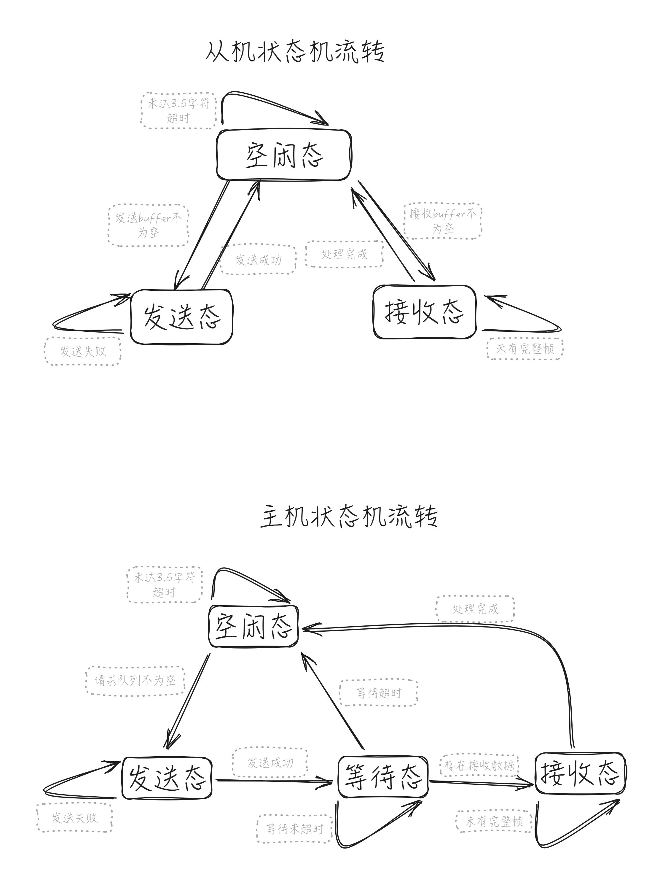

# modbusX
一个正在开发中的modbus协议解析栈。

我对协议库的理解是：只需要另外实现数据的流入和流出port，并最多另外定时调用一个时基函数，就可以驱动起整个库。

我真的很难理解其他modbus开源库的想法，有些想要接管系统中断，大部分需要疯狂阻塞，或者要占用线程等待事件发射。

真的有这么复杂和困难吗？我不相信，于是决定自己做一个。

# 特性

我希望有这样的modbus实现，是硬性需求，同时也是这个库最终的特性。

> 1. 不阻塞
> 2. 不占线程
> 3. 不占中断
> 4. 多主多从
> 5. 寄存器地址表与内存地址任意映射

我过去实现的modbus库虽然非常简陋，但是已经满足了上述需求，并且已经用于生产环境。
但是既然决定做成开源库的形式，该有的机制现在都要加上去。包括我觉得简直愚蠢的3.5字符间隔。


# 如何使用

## RTU从机

首先实现通信端口的port函数类似如下

```C
/**
 * @brief 将 MBX_SEND_MODE_BYTES 宏置1后, 可用多字节发送port
 * @param Data 发送buffer指针
 * @param Len 期望发送的长度
 * @return port标准返回
 */
uint32_t SerialSendPort(const void *Data, size_t Len)
{
    WINBOOL b     = FALSE; // 发送操作标识
    DWORD   wWLen = 0;     // 实际发送数据长度
    /* 尝试发送 */
    b = WriteFile(comHandle, Data, Len, &wWLen, NULL);
    if(b && wWLen == Len)
        return MBX_PORT_RETURN_DEFAULT;
    else
        return MBX_PORT_RETURNT_ERR_INDEFINITE;
}

/**
 * @brief 数据接收port, 实现功能为取单字节, 返回值表示是否取接收成功
 * @param Data 字节指针, 取到的字节
 * @return port标准返回
 */
uint32_t SerialGetcPort(uint8_t *Data)
{
    WINBOOL b     = FALSE; // 接收操作标识
    DWORD   wRLen = 0;     // 实际接收数据长度
    /* 尝试接收 */
    b = ReadFile(comHandle, Data, 1, &wRLen, NULL);
    if(b == TRUE && wRLen == 1)
    {
        return MBX_PORT_RETURN_DEFAULT;
    }
    else
    {
        return MBX_PORT_RETURNT_ERR_INDEFINITE;
    }
}
```


然后制作一张类似如下的地址映射表，注意以下两点，

> 1. 数据模型的**寄存器地址必须递增**，库内使用二分法查找以提高查找效率
> 2. **如果映射到的内部内存变量相同，那么回调处理也应该相同**，因为库会最终将整个变量期望修改的值以void*形式传入写时回调，写时回调应当再翻译为对应的数据，详见例程 [在windows平台的从机例子](Example/win_test/Win_Smain.c)

```c
/* 供映射的内存区域 */
uint8_t  u8MapMem[64];
uint16_t u16MapMem[64];
uint32_t u36MapMem[64];
uint64_t u64MapMem[64];
float    fMapMem[64]; // 32位数据模型
double   dMapMem[64]; // 64位数据模型

/* 为了实现更快速的查找，库内采用二分法查询地址表
    地址表必须手动以升序排列，由于C11标准不支持动态宏，暂时无法在编译阶段自动检查 */
static const _MBX_MAP_LIST_ENTRY MapList[] = {
    /*  寄存器地址        映射到的内部内存              内部内存数据属性         写时回调(NULL为只读寄存器)  */
    {.Addr = 0x0000, .Memory = &u8MapMem[0],  .Type = MBX_REG_TYPE_U8,    .Handle = u8WriteTest1 },
    {.Addr = 0x0001, .Memory = &u8MapMem[1],  .Type = MBX_REG_TYPE_U8,    .Handle = u8WriteTest2 },
    {.Addr = 0x0002, .Memory = &u8MapMem[2],  .Type = MBX_REG_TYPE_U8,    .Handle = NULL         },
    {.Addr = 0x0003, .Memory = &u8MapMem[3],  .Type = MBX_REG_TYPE_U8,    .Handle = NULL         },
    
    {.Addr = 0x0100, .Memory = &u16MapMem[0], .Type = MBX_REG_TYPE_U16,   .Handle = u16WriteTest1},
    {.Addr = 0x0101, .Memory = &u16MapMem[1], .Type = MBX_REG_TYPE_U16,   .Handle = u16WriteTest2},
    
    {.Addr = 0x0200, .Memory = &u36MapMem[0], .Type = MBX_REG_TYPE_U32_H, .Handle = u32WriteTest1},
    {.Addr = 0x0201, .Memory = &u36MapMem[0], .Type = MBX_REG_TYPE_U32_L, .Handle = u32WriteTest1},
    
    {.Addr = 0x0300, .Memory = &u64MapMem[0], .Type = MBX_REG_TYPE_U64_3, .Handle = u64WriteTest1},
    {.Addr = 0x0301, .Memory = &u64MapMem[0], .Type = MBX_REG_TYPE_U64_2, .Handle = u64WriteTest1},
    {.Addr = 0x0302, .Memory = &u64MapMem[0], .Type = MBX_REG_TYPE_U64_1, .Handle = u64WriteTest1},
    {.Addr = 0x0303, .Memory = &u64MapMem[0], .Type = MBX_REG_TYPE_U64_0, .Handle = u64WriteTest1},
    
    {.Addr = 0x0400, .Memory = &fMapMem[0],   .Type = MBX_REG_TYPE_U32_H, .Handle = fWriteTest1  }, 
    {.Addr = 0x0401, .Memory = &fMapMem[0],   .Type = MBX_REG_TYPE_U32_L, .Handle = fWriteTest1  },
    
    {.Addr = 0x0500, .Memory = &fMapMem[0],   .Type = MBX_REG_TYPE_U64_3, .Handle = dWriteTest1  }, 
    {.Addr = 0x0501, .Memory = &fMapMem[0],   .Type = MBX_REG_TYPE_U64_2, .Handle = dWriteTest1  },
    {.Addr = 0x0502, .Memory = &fMapMem[0],   .Type = MBX_REG_TYPE_U64_1, .Handle = dWriteTest1  }, 
    {.Addr = 0x0503, .Memory = &fMapMem[0],   .Type = MBX_REG_TYPE_U64_0, .Handle = dWriteTest1  },

    MBX_MAP_LIST_END
};
```


在主程序中进行初始化

```c
/* 申请从机对象发送及接收buffer */
uint8_t *SRxBuffer = (uint8_t *)malloc(84 * sizeof(uint8_t));
uint8_t *STxBuffer = (uint8_t *)malloc(84 * sizeof(uint8_t));

/* 初始化RTU从机1 */
MBx_Slave_RTU_Init(&MBxSlave,      // 从机对象
                   1,              // 从机ID
                   MapList,        // 地址映射表
                   SerialSendPort, // 发送函数
                   SerialGetcPort, // 接收函数
                   9600,           // 波特率
                   SRxBuffer,      // 库内接收buffer分配
                   84,             // 接收buffer最大长度
                   STxBuffer,      // 库内发送buffer分配
                   84);            // 发送buffer最大长度

/* 假装初始化从机2(如果真的有，把传参填写正常) */
MBx_Slave_RTU_Init(&MBxSlave2,     // 从机对象
                    2,              // 从机ID
                    MapList,        // 地址映射表
                    MBX_PARA_NULL,  // 发送函数
                    MBX_PARA_NULL,  // 接收函数
                    MBX_PARA_NULL,  // 波特率
                    MBX_PARA_NULL,  // 库内接收buffer分配
                    MBX_PARA_NULL,  // 接收buffer最大长度
                    MBX_PARA_NULL,  // 库内发送buffer分配
                    MBX_PARA_NULL); // 发送buffer最大长度
```


周期调用驱动函数即可

```c
    while(1)
    {
        MBx_Ticks(1000);  // 换算为微秒传入MBx驱动 链表自动驱动
        Sleep(1);          // 周期1ms
    }
```

# 程序状态机


